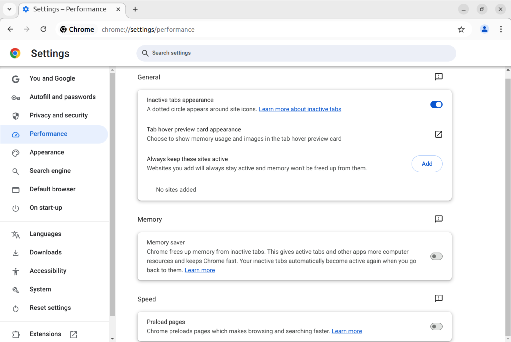

# members-only

Project to show the users' favourite YouTube videos

This is my version of the
[members-only](https://www.theodinproject.com/lessons/node-path-nodejs-members-only)
project from The Odin Project. Users can show their favourite YouTube videos
here with their comment. There are users with member status and there is the
admin of the site. You can get the member status after registration with typing
in the following password:

No, it's not going to be so easy for you:) If you visit my
[fakebook](https://alexerdei73.github.io/fakebook) app, there is the latest
post. All you need to know the name of that song, which is on the video. This is
the member password with capitalizes first letter and spaces between words. The
thing is a bit tricky as it is the latest post now, but if other members post
there they can confuse you, so try to find the right post there:)

Registered users can make posts with videos, but they can't see, who created the
other posts and when. Registered userscan like videos as well. This is going to
be an extra functionality compared to TOP requirements.

Members can see, who created the posts and when and they can create anonym
posts.

The admin user is me. I think you won't be able to find out the admin password,
although you can try to crack it:) The admin user can delete posts too.

## Warning

The app is not working with the default settings of the chromium based browsers
included Google Chrome. You need to turn off the Preload pages setting at the
Performance menu. See the image:

